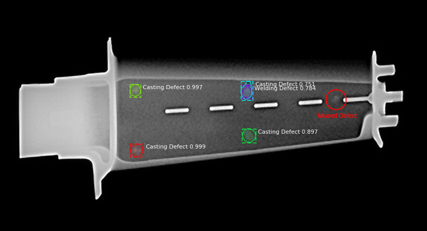
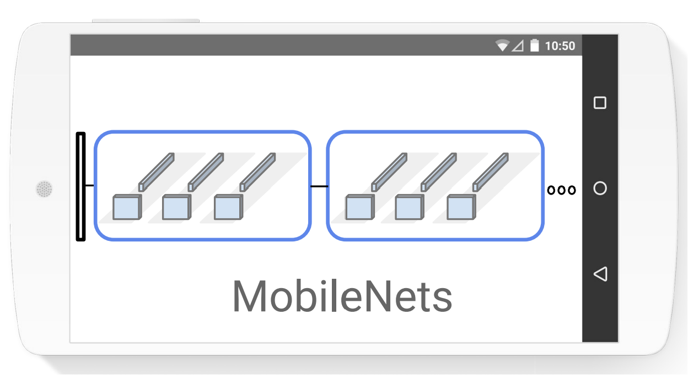
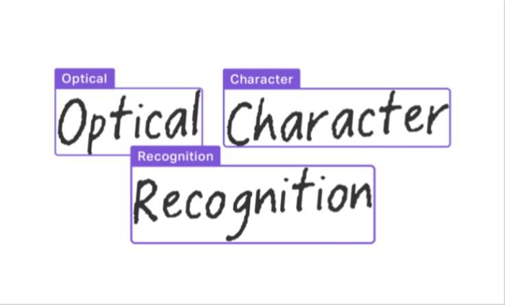
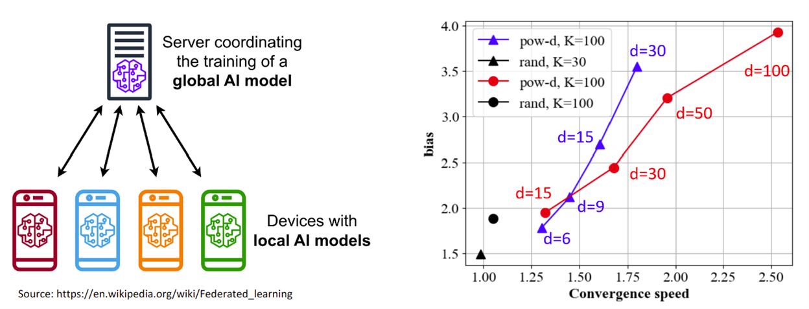

I have experience of applying machine learning (deep learning, NLP and CV) to both industry projects and self-motivated projects. [[GitHub]](https://github.com/peng-ju)

- Experienced with data analysis, data engineer, image processing, and numerical simulation with python.
- Having a broad knowledge in different machine learning systems. Able to build and apply common machine learning, deep learning, computer vision, and natural language processing algorithms from scratch with python (PyTorch). 
- Familar with state-of-art machine learning algorithms. Able to fine-tune and apply pre-trained models (e.g. from GitHub, Hugging Face).

---
The Data Mine, Purdue University. Graduate Researcher. 2023-01 - 2023-05.
[[Slide]](https://github.com/peng-ju/Turbine_blade_anomaly_detection)

- Collaborated with **Howmet Aerospace**. Developed an X-ray image based anomaly detection algorithm for the turbine blades. The algorithm combines image preposessing (OpenCV), fine-tuned pre-trained CNN model, and logistic regression.
- Skillset: Computer Vision, Deep Learning, Pytorch, OpenCV, GitHub, Agile Methodologies. 

---
The Data Mine, Purdue University. Graduate Research Assistant. 2023-05 - 2023-12. 
- Collaborate with **Eli Lilly and Company**. Advisor: James Rimell and Prof. Mark Daniel Ward. 
- Extracted text metadata from images with transformer-based optical character recognition (**OCR**) models. 
- Designed, implemented and deployed data ingestion pipelines to automate metadata extraction with Apache Airflow, Kubernetes, MinIO/AWS, Docker. 
- Developed a statistic algorithm for data anomaly detection with PostgreSQL and pandas.

---
Purdue University, Graduate researcher. 2023-10 - 2023-12. [[Code]](https://dagshub.com/peng-ju/Power-of-Choice) [[Paper]](https://dagshub.com/peng-ju/Power-of-Choice/src/main/Report-ReScience.pdf) [[Slide]](https://dagshub.com/peng-ju/Power-of-Choice/src/main/Presentation-Hackathon.pdf)

<mark><b>
1st Place - 2023 ML@Purdue X DagsHub Machine Learning Hackathon Advanced Track
</b></mark>
- Performed replication and ablation studies on a novel federated learning (**discentralized** machine learning) algorithm. "Towards Understanding Biased Client Selection in Federated Learning". [[Orginal Paper]](https://proceedings.mlr.press/v151/jee-cho22a.html)
- Implemented federated learning with biased client selection strategy, increasing convergence speed of MLP models by over 3 times. 
- Ensured traceability and reproducibility of image classification and sentiment analysis federated learning experiments with **MLflow** and Dagshub.

