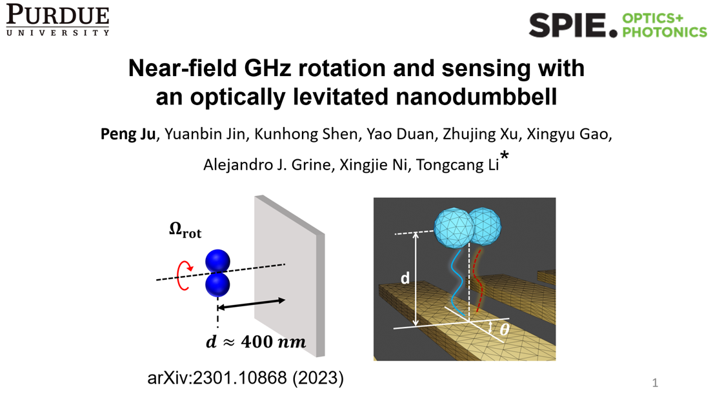
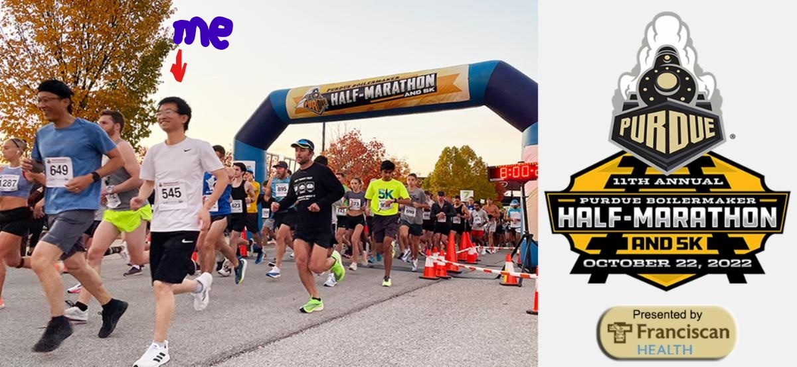
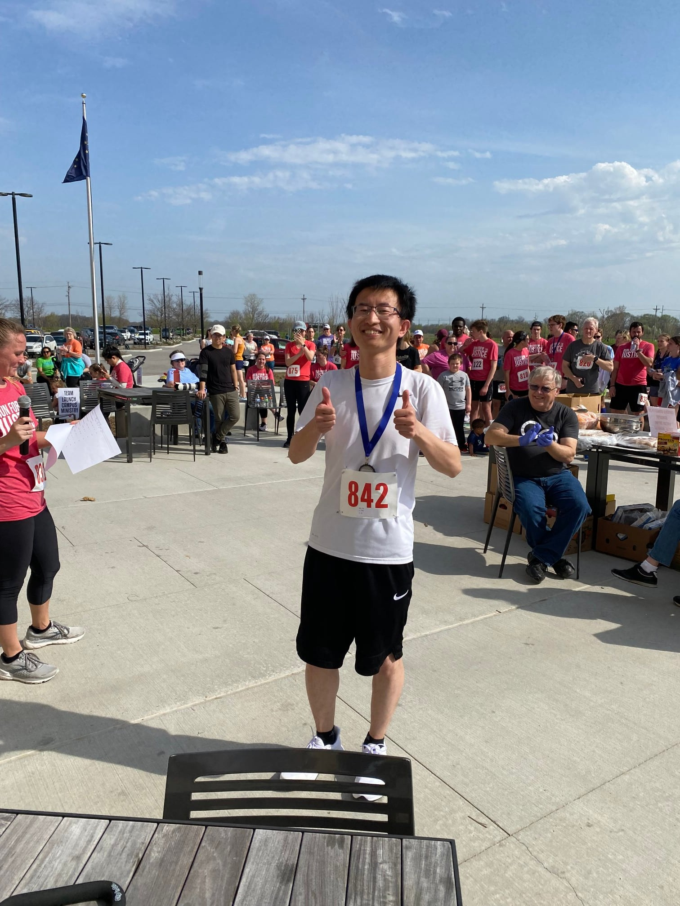

### 2023-08 Glad to present our recent research progress in SPIE Optics + Photonics [[Video]](https://www.spiedigitallibrary.org/conference-proceedings-of-spie/PC12649/PC126490M/GHz-rotation-and-sensing-with-an-optically-levitated-nanodumbbell-near/10.1117/12.2676898.full?SSO=1)

---
### 2022-10 Purdue Half Marathon [[link]](https://purduehalf.com/)

---
### 2022-04 Run for Justice - 10k, first place(Men25-30)! [[link]](https://www.runforjustice.net/)

