### Selected Publications
For a full list of my publications, please refer to my [google scholar](https://scholar.google.com/citations?user=vPl5ZHoAAAAJ&hl=en&oi=ao).  

---
#### Levitated optomechanics

We demonstrated GHz rotation and ultra-sensitive torque detection with an optically levitated nanodumbbell both in free space and near a surface. We performed five-dimensional feedback cooling on an levitated nanodumbbell. We conducted on-chip levitation with both nanofabricated metalens and surface ion trap.

[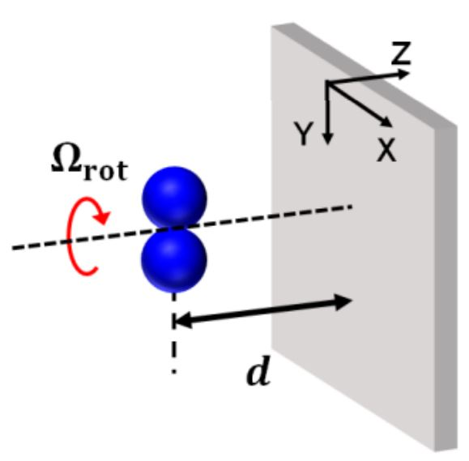](img/RoateNearSurface.JPG)
[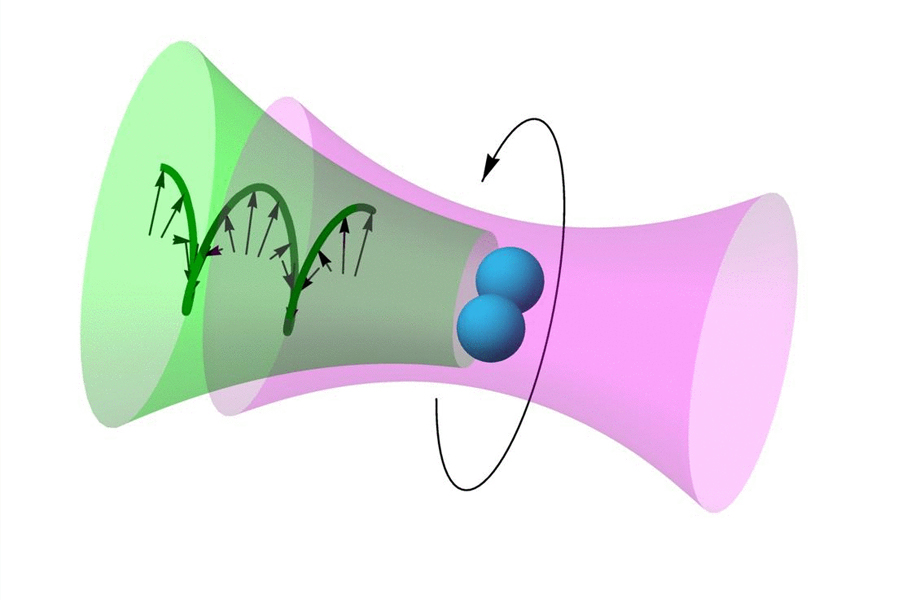](img/img/fastest_spin.jpg)
[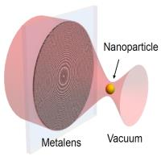](img/OnChipLevitation.jpg)
[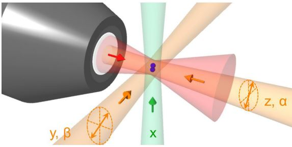](img/FiveDCooling.JPG)
[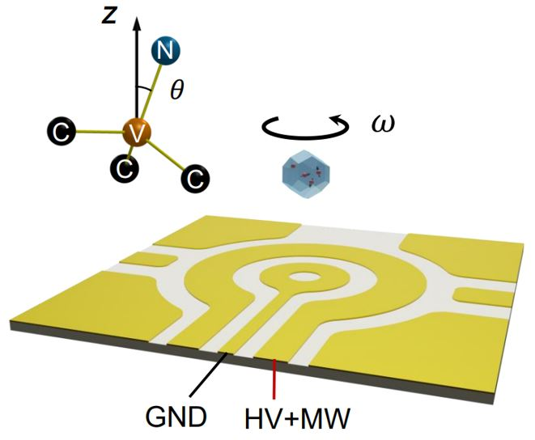](img/Rotate_ND.JPG)

6. 'Quantum control and fast rotation of levitated diamonds in high vacuum', Y. Jin, K. Shen, **P. Ju**, X. Gao, C. Zu, A. J. Grine and T. Li, arXiv:2309.05821  (2023). [[Paper]](https://arxiv.org/abs/2309.05821).  
5. 'Near-field GHz rotation and sensing with an optically levitated nanodumbbell', **P. Ju**, Y. Jin, K. Shen, Y. Duan, Z. Xu, X. Gao, X. Ni, T. Li, Nano Letters 23 (22), 10157-10163 (2023). [[Paper]](https://pubs.acs.org/doi/full/10.1021/acs.nanolett.3c02442#) [[Video]](https://www.spiedigitallibrary.org/conference-proceedings-of-spie/PC12649/PC126490M/GHz-rotation-and-sensing-with-an-optically-levitated-nanodumbbell-near/10.1117/12.2676898.full?SSO=1)
4. 'On-chip optical levitation with a metalens in vacuum', K. Shen, Y. Duan, **P. Ju**, Z. Xu, X. Chen, L. Zhang, J. Ahn, X. Ni, T. Li. Optica 8 (11), 1359-1362 (2021). [[Paper]](https://opg.optica.org/optica/fulltext.cfm?uri=optica-8-11-1359&id=461986)
3. 'Coupled dynamics of an optically levitated nanodumbbell', **P. Ju**, J. Bang, T. Seberson, J. Ahn, Z. Xu, X. Gao, F. Robicheaux, T. Li, Laser Science, LTh2G. 3 (2020). [[Paper]](https://opg.optica.org/abstract.cfm?uri=LS-2020-LTh2G.3)
2. 'Five-dimensional cooling and nonlinear dynamics of an optically levitated nanodumbbell', J. Bang, T. Seberson, **P. Ju**, J. Ahn, Z. Xu, X. Gao, F. Robicheaux, T. Li, Physical Review Research 2 (4), 043054 (2020). [[Paper]](https://journals.aps.org/prresearch/abstract/10.1103/PhysRevResearch.2.043054)
1. 'Ultrasensitive torque detection with an optically levitated nanorotor', J. Ahn, Z. Xu, J. Bang, **P. Ju**, X. Gao, T. Li, Nature Nanotechnology 15 (2), 89-93 (2020). [[Paper]](https://www.nature.com/articles/s41565-019-0605-9)

---
#### Spin qubit

We studied solid-state spins in 3D (nitrogen-vacancy center in diamond), 2D (Hexagonal boron nitride) and 1D (boron nitride nanotube) materials. We designed and fabricated coplanar waveguide to control electron spins and nuclear spins. 

[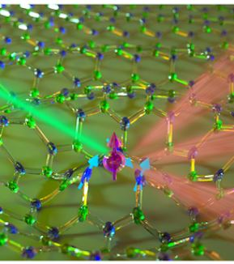](img/HBN.JPG)
[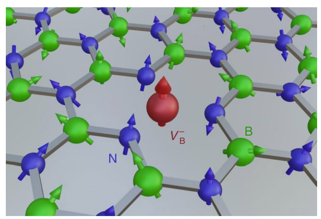](img/HBN_2d.png)
[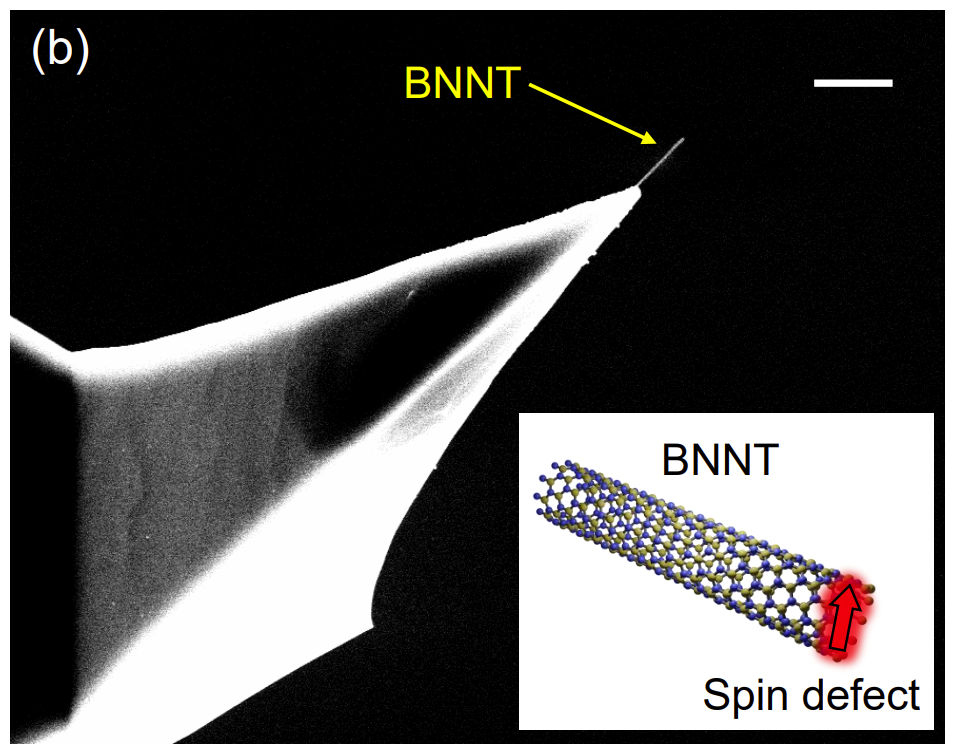](img/HBN_nanotube.png)
[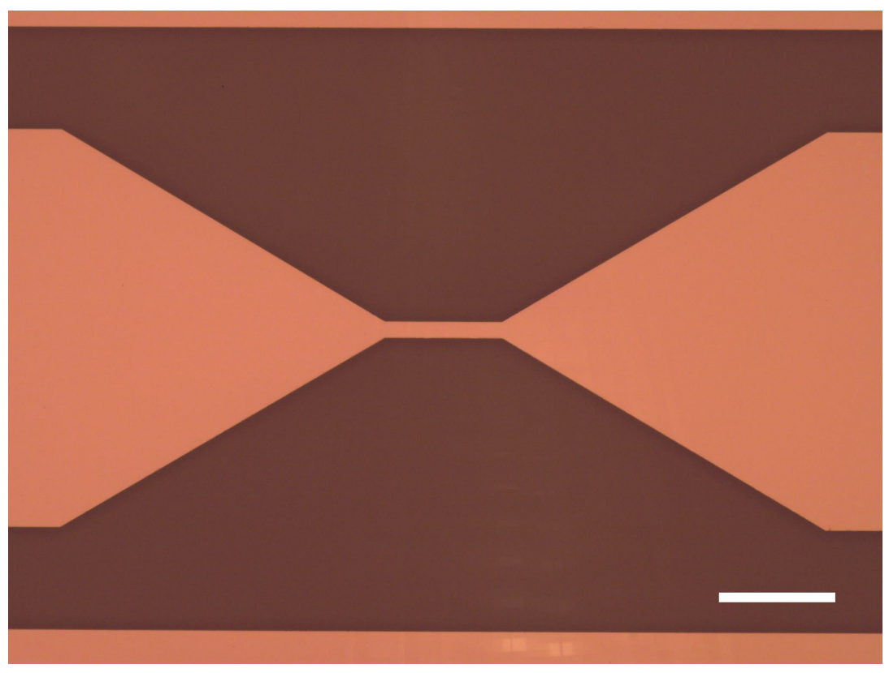](img/waveguide.png)

3. 'Nanotube spin defects for omnidirectional magnetic field sensing', X. Gao, S. Vaidya, S. Dikshit, **P. Ju**, K. Shen, Y. Jin, S. Zhang, and T. Li, arXiv: 2310.02709 (2023). [[Paper]](https://arxiv.org/pdf/2310.02709.pdf)
2. 'Nuclear spin polarization and control in hexagonal boron nitride', X. Gao, S. Vaidya, K. Li, **P. Ju**, B. Jiang, Z. Xu, A. Allcca, K. Shen, T. Taniguchi, K. Watanabe, S. A Bhave, Y. P Chen, Y. Ping, T. Li, Nature Materials 21 (9), 1024-1028 (2022). [[Paper]](https://www.nature.com/articles/s41563-022-01329-8)
1. 'High-contrast plasmonic-enhanced shallow spin defects in hexagonal boron nitride for quantum sensing', X. Gao, B. Jiang, A. Allcca, K. Shen, M. A Sadi, A. B Solanki, **P. Ju**, Z. Xu, P. Upadhyaya, Y. P Chen, S. A Bhave, T. Li, Nano Letters 21 (18), 7708-7714 (2021). [[Paper]](https://pubs.acs.org/doi/10.1021/acs.nanolett.1c02495)

---
#### Quantum Vaccum Fluctuation

We studied three-body optomechanic system interacting with virtual photons. We simulated virtual photon induced torque between a nanodumbbell and a nanograting.

[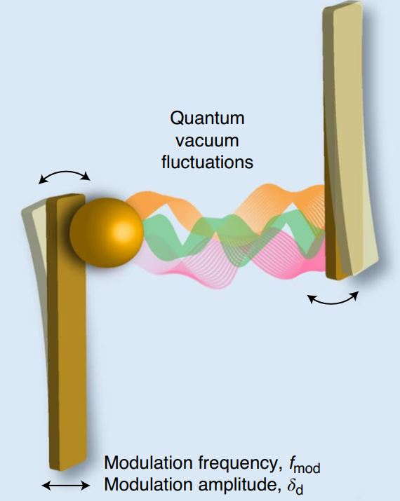](img/Casimir1.JPG)
[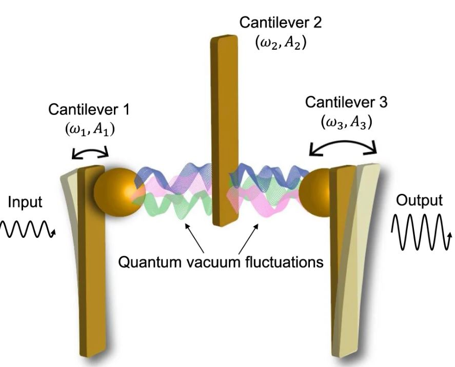](img/Casimir2.JPG)
[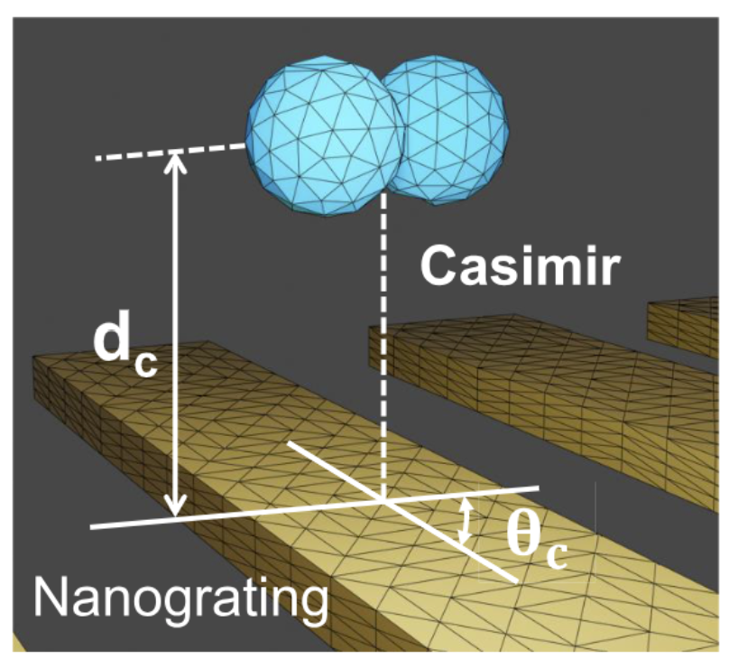](img/Casimir_nanodumbbell.png)

2. 'Near-field GHz rotation and sensing with an optically levitated nanodumbbell', **P. Ju**, Y. Jin, K. Shen, Y. Duan, Z. Xu, X. Gao, X. Ni, T. Li, Nano Letters 23 (22), 10157-10163 (2023). [[Paper]](https://pubs.acs.org/doi/full/10.1021/acs.nanolett.3c02442#) [[Video]](https://www.spiedigitallibrary.org/conference-proceedings-of-spie/PC12649/PC126490M/GHz-rotation-and-sensing-with-an-optically-levitated-nanodumbbell-near/10.1117/12.2676898.full?SSO=1)
1. 'Observation and control of Casimir effects in a sphere-plate-sphere system', Z. Xu, **P. Ju**, X. Gao, K. Shen, Z. Jacob, T. Li, Nature Communications 13 (1), 1-8 (2022). [[Paper]](https://www.nature.com/articles/s41467-022-33915-4)

---
#### Talks
4. 'GHz rotation and sensing with an optically levitated nanodumbbell near a surface', SPIE Optics and Photonics (2023). [[Video]](https://www.spiedigitallibrary.org/conference-proceedings-of-spie/PC12649/PC126490M/GHz-rotation-and-sensing-with-an-optically-levitated-nanodumbbell-near/10.1117/12.2676898.full?SSO=1)  
3. 'Ultrasensitive torque detection and 5D cooling of optically levitated nanoparticles', APS March meeting (2021). [[Link]](https://meetings.aps.org/Meeting/MAR21/Session/J31.2)
2. 'Ultrasensitive torque detection with an optically levitated nanorotor', UniKORN Seminar (2021). [[Video]](https://www.youtube.com/watch?v=1Uv6hEnyZtA&t=3609s&ab_channel=UniKORNSeminars)
1. 'Coupled dynamics of an optically levitated nanodumbbell', Laser Science, LTh2G. 3 (2020). [[Video]](https://opg.optica.org/abstract.cfm?uri=LS-2020-LTh2G.3#videoPlayer)

---
#### Posters
1. 'Near-field GHz rotation and sensing with an optically levitated nanodumbbel', GRC, Mechanical Systems in the Quantum Regime (2022). [[Link]](https://www.grc.org/mechanical-systems-in-the-quantum-regime-conference/2022/)

---
#### Other Experience
Reviewer for Photonics Research, Physics Review A, Optics Letters, Optics Express, Scientific Reports, AIP advances, et al.
